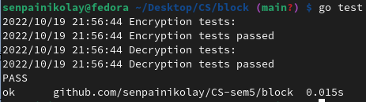

# Laboratory Work 2. The Part with Stream Cipher. 

### Course: Cryptography & Security
### Author: Nicolae Gherman

----

## Theory 
A symmetric cipher is one that uses the same key for encryption and decryption. 
Symmetric ones use the same key (called a secret key or private key) for transforming the original message, called plaintext, into ciphertext and vice versa.  <br> 
A block cipher is an encryption algorithm that encrypts a fixed size of n-bits of data - known as a block - at one time. 


## Objectives:

* Get familiar with block ciphers. 
* Implement the Encryption and Decryption methods of a choose algorithm,  DES in this case.

## Implementation description
I have to introduce you to the Permute method which will be constantly used to modify/permute a the bit array: 
   -  k []string : array of bits represented as chars 
   -  arr []int : specific/predifined array of  indexes( example Final Permutation indexes, Key Compression indexes, DBox etc.) 
   - n int  just defines the length of wanted modified bit array. 
 
```  
// permutations.go  row-103
func Permute(k []string, arr []int, n int) []string {
	var perm []string
	for i := 0; i < n; i++ {
		perm = append(perm, k[arr[i]-1])
	}
	return perm
}

``` 
Before the encryption process of DES, we will start with Key transformation.  
First we have to discard 8th bits of initial key. We will use the p.Permute Method to parse an predifined array of indexes which defines this 8th bit discardment.  
So the key is tranformed from 64-bit to 56-bit. 
```  
// key.go : row-40
keyBinArr := p.HexToBinArray(p.StringToHex(c.StringVal))

	keyp := []int{//Indexes to Permute the key arr }

	finalKey := p.Permute(keyBinArr, keyp, 56)
	c.InitKey56BitValue = finalKey 
```
Then we will divide the array of bits in 2 halves.  Then going through 16 rounds, we will shift left the halves, either by 1 time (INDEX: 1, 2, 9, 16) or 2 times. A  table "ShiftPerRound" with number of shifts is predifined. After shifting is done on 2 parts, they are combined and the Key is "compressed" to 48 bit. KC is another compression predifined array of indexes. So the key is just permutated by those indexes  not more than 48bits. Then, the corresponding/rounded/compressed key for each round is saved in an array.
 
```  
// key.go : row 57
left, right := c.InitKey56BitValue[0:28], c.InitKey56BitValue[28:56]
var combine_str []string

	for i := 0; i < 16; i++ {
		// Shifting the bits by 1 or 2 bits
		left = ShiftLeft(left, ShiftPerRound[i])
		right = ShiftLeft(right, ShiftPerRound[i])
		combine_str = append(left, right...)

		//  56 to 48 bits key compression
		round_key := p.Permute(combine_str, KC, 48)

		c.KeyPerRoundArr = append(c.KeyPerRoundArr, round_key)
	} 
``` 
--- 
#### Cool! Now we have the keys generated per round, we can go with the plaintext and: 
1. Encryption:  

It follows the DES algorithms steps and a lot of Permutations on pre-defined arrays of indexes. <br> 
 
+ The 64-bit plaintext is transformed in a array of bits and goes through the Initial Permution  
+ The bits are divided in two halves of 32 bits array. 
+ Expansion permutation/DBox permutation is applied on Right Part 
+ Then the result is xored with Specific key of that round. 
+ The xored result goes thought S-BOX substitution. S-Box is predifined
+ The P box  permutation  is applied on array of bits from S-Box. 
+ The left part is reassigned by   xored operation of initial left part and result after p box 
+ if it is not the last round, the left part is swapped with the right one.  
+ After 16 round, the Final Permutation is made. 


```  
// des.go : row-31

	binStArr := p.HexToBinArray(hexString)
	binStArr = InitialPerm(binStArr) 
	 

	LPT, RPT := binStArr[:32], binStArr[32:]

	for i := 0; i < 16; i++ {

		dbox := p.Permute(RPT, EXP_DBOX_Perm, 48)
		xored := XorStringBitArr(dbox, bc.KeysPerRound[i])
		sbox_strArr := SBoxSub(xored)
		sbox_strArr = p.Permute(sbox_strArr, PBOX_Perm, 32)
		result := XorStringBitArr(LPT, sbox_strArr)
		LPT = result
		if i != 15 {
			LPT, RPT = RPT, LPT

		}

	}
	combine_strArr := append(LPT, RPT...)
	cipher := p.Permute(combine_strArr, FP, 64)

	return ConvertBinArrToHex(cipher) 
```  

2. Decryption  
For the Decryption, the Keys Per Round array is reversed with the help of this func:  
``` 
// key.go row-32 
func ReverseKeysArray(arr []StringArr) []StringArr {
	temp := arr
	for i, j := 0, len(arr)-1; i < j; i, j = i+1, j-1 {
		arr[i], arr[j] = arr[j], arr[i]
	}
	return temp
} 
```  

Then it follows the same logic described above ub Encrytion.  
``` 
	bc.KeysPerRound = k.ReverseKeysArray(bc.KeysPerRound)
	bc.Encrypt(pt)

``` 


## The Screenshot Regarding the runing tests form des_test.go:  



