# Laboratory Work 5. Authentication and Authorization.

### Course: Cryptography & Security
### Author: Nicolae Gherman

----

## Theory 
Authentication and authorization are two vital information security processes that administrators use to protect systems and information. Authentication verifies the identity of a user or service, and authorization determines their access rights.


## Objectives:

* Get familiar with authorization and authentication.
* Implement Authentication and integrate Authorization on existing project components.

## Implementation description 
##### The main folders to follow are  /controllers && /models && /server.  

I have implemented a simple http server with sqlite database. I have used 3 classical ciphers to demonstrate authorization tests and 2 methods of authentication. <br> 
<b> Authentication </b> resumes to a conceptual OTP (One Time Password)  which are popular among phone/sms verifications.  Additional, I have a server route for Google API which redirects back the user once logged in with email.  <br> 
<b> Authorization </b> resumes to the user model attributes. Simple User is able to use Simple Caesar. OTP verfied user is able to user Caesar With Alphabet Permutation && Simple Caesar but not PLayfair.   The OTP && OAuth verfied users are able to use all 3 ciphers :) .  

---- 
#### Taking it step by step. 

The users model follows this structure: 

``` 
models/usermodel.go 

type User struct {
	ID       uuid.UUID  // user univeral id : library for unique ids in database
	Name     string   
	Email    string   
	Password string    

	Otp_enabled  bool 
	Otp_verified bool 

	Otp_secret     string
	Otp_auth_url   string
	OAuth_verified bool
}
```  
From the start, the user is able to register && log in. Cool. Let's get conceptual!  <br> 
Next, the idea of One Time Password is like a session. Firstly, a OTP_secret is generated && OTP_auth_url is redirecting (conceptually) the user. <br>
The logic: 
```  
/controllers/controller.go

func (ac *AuthController) GenerateOTP(ctx models.OTPInput) string { 
    // secret 
	key, err := totp.Generate(totp.GenerateOpts{
		Issuer:      "MESSAGE_SENT_OTP_TEST:",
		AccountName: "ACCOUNT@mail.com",
		SecretSize:  15,
	})  

    // info saved.
	dataToUpdate := models.User{
		Otp_secret:   key.Secret(),
		Otp_auth_url: key.URL(),
	}
	ac.DB.Model(&user).Updates(dataToUpdate)
}

```
Then, the user, conceptually, introduces the secret key generated and would proceed to Verification and Validation! 

```  
/controllers/controller.go

func (ac *AuthController) VerifyOTP(ctx models.OTPInput) string { 
	valid := ctx.Token == user.Otp_secret
	if !valid {
		return "not valid"
	}

	dataToUpdate := models.User{
		Otp_enabled:  true,
		Otp_verified: true,
	}

	ac.DB.Model(&user).Updates(dataToUpdate)
}
``` 

The final part is actually disabling this OTP attribute of the user because it is a temporary verification.   

``` 
/controllers/controller.go

func (ac *AuthController) DisableOTP(ctx models.OTPInput) string {

	user.Otp_enabled = false
	ac.DB.Save(&user)
}
```

This concept may be applied, for example, through SMS verification.  <br> 

Additionally, I have integrated OAuth Google API. Once logged in, it switches the bool OAuth_verified attribute of the user.  

```  
server/httpServer.go 

func handleGoogleCallback(w http.ResponseWriter, r *http.Request) {
	content, err := getGoogleUserInfo(r.FormValue("state"), r.FormValue("code"))
	if err != nil {
		fmt.Println(err.Error())
		http.Redirect(w, r, "/", http.StatusTemporaryRedirect)
		return
	}
	fmt.Fprintf(w, "Content: %s\n  User Updated: %s ", content, AuthController.ValidateOAuth(oauthStateString))
} 
``` 

Overall, the server handlers look like this: 
```   
server/httpServer.go 
 
func RunServer() {

	r := mux.NewRouter()
	// Basic
	r.HandleFunc("/register", RegisterUser).Methods("POST")
	r.HandleFunc("/login", LogInUser).Methods("POST")
	// OTP
	r.HandleFunc("/generateOTP", GenerateOTP).Methods("POST")
	r.HandleFunc("/verifyOTP", VerifyOTP).Methods("POST")
	r.HandleFunc("/validateOTP", ValidateOTP).Methods("POST")
	r.HandleFunc("/disableOTP", DisableOTP).Methods("POST")

	//Google
	r.HandleFunc("/login-google/{id}", handleGoogleLogin)
	r.HandleFunc("/callback", handleGoogleCallback)

	// Classical Ciphers
	r.HandleFunc("/caesar-simple/{method}", handleCaesarSimple)
	r.HandleFunc("/caesar-perm/{method}", handleCaesarWithPerm)
	r.HandleFunc("/playfair/{method}", handlePlafair)

	http.ListenAndServe(":8080", r)
} 
``` 

###### For the Authorization part,  I would post the proof of requests:  

I get straight to the OTP requests:  
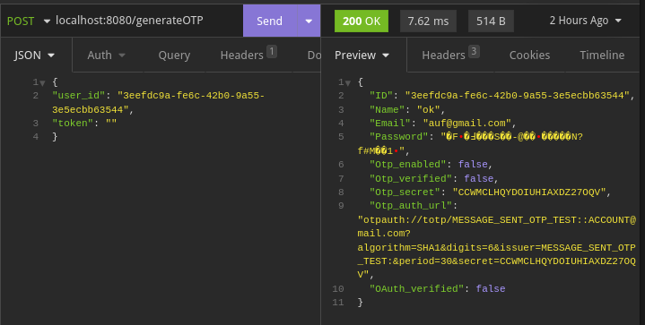  

Then it goes through validation and dissabling the OTP.  
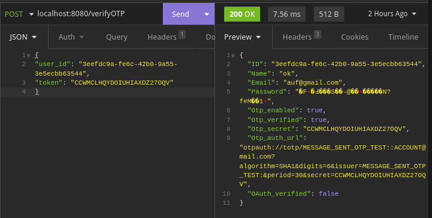   
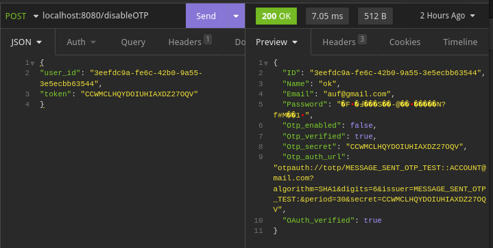   

As a simple user it can use the Caesar Simple cipher:  
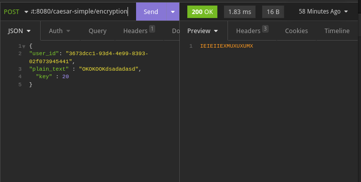   
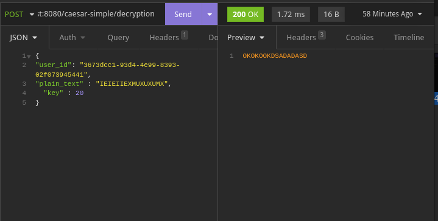 

Also a simple user, without OTP verification would get:  
   
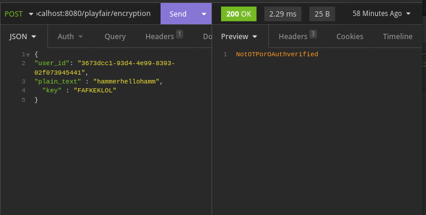  

As we already did the validation, we can use it:  
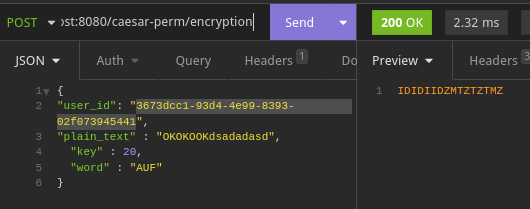   
  


But without OAuth Google attribute, we wont be agle to use the Playfair cipher: 
   
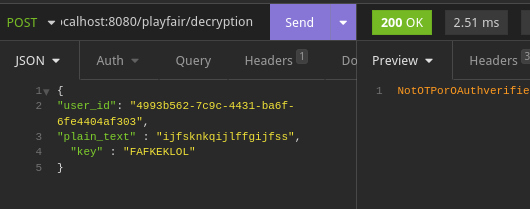  

To prove the OAuth, I have included the Authentication part:  
   
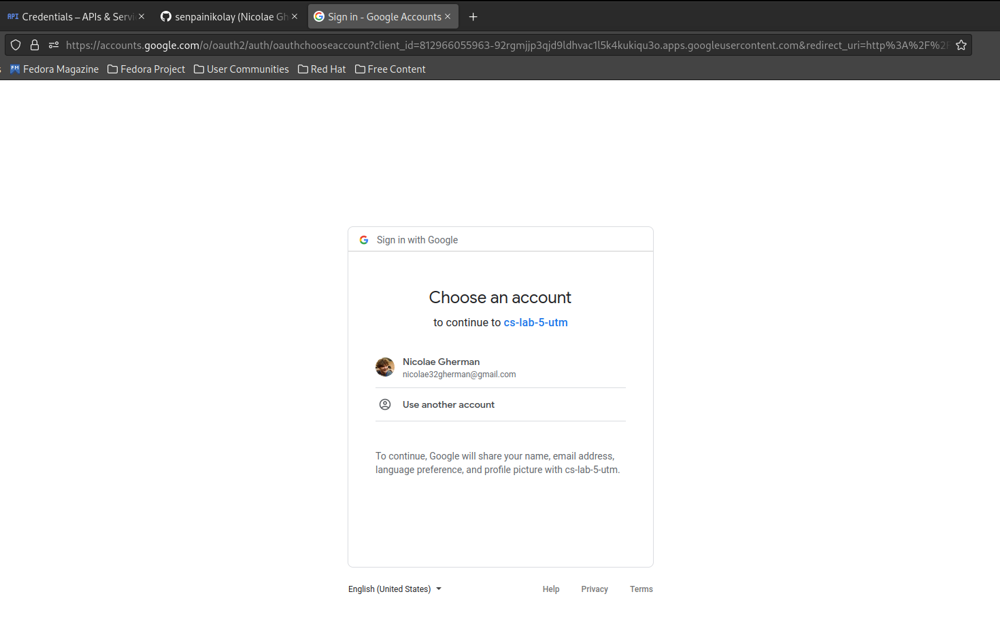  

We get the response with user info: 
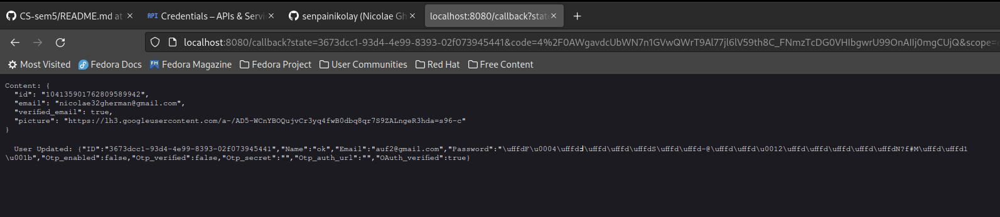   

Now we can use the actualy Playfair cipher: 
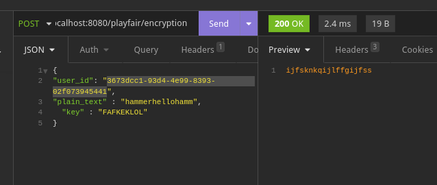   
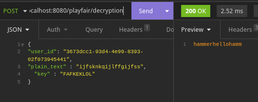 


And  a piece of code how the requests are handled and the simplity of logic: 

``` 
server/httpServer.go 

func handlePlafair(w http.ResponseWriter, r *http.Request) {
	w.Header().Set("Content-Type", "application/json")
	w.WriteHeader(http.StatusOK)

	var input models.Playfair
	err := json.NewDecoder(r.Body).Decode(&input)
	if err != nil {
		log.Fatalln("There was an error decoding the request body into the struct")
	}

	if !AuthController.IsOTPVerified(input.UserId) || !AuthController.IsOAuthVerified(input.UserId) {
		fmt.Fprint(w, "Not OTP or OAuth verified")
		return
	}

	var resp string
	vars := mux.Vars(r)

	switch vars["method"] {
	case "encryption":
		cPf := classicalCiphers.Playfair{Msg: input.PlaintText, Key: input.Key}
		cPf.Init()
		resp = cPf.Encrypt()
	case "decryption":
		cPf := classicalCiphers.Playfair{Msg: input.PlaintText, Key: input.Key}
		cPf.Init()
		resp = cPf.Decrypt()
	default:
		resp = "Method incorrectly specified"
	}
	fmt.Fprint(w, resp)
} 


```

## That's all folks!


