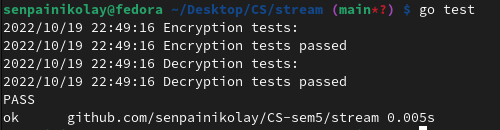

# Laboratory Work 2. The Part with Stream Cipher. 

### Course: Cryptography & Security
### Author: Nicolae Gherman

----

## Theory 
A symmetric cipher is one that uses the same key for encryption and decryption. 
Symmetric ones use the same key  for transforming the original message, called plaintext, into ciphertext and vice versa.  <br> 
A stream cipher is an encryption algorithm that encrypts 1 bit or byte of plaintext at a time. It uses an infinite stream of pseudorandom bits as the key. For a stream cipher implementation to remain secure, its pseudorandom generator should be unpredictable and the key should never be reused.


## Objectives:

* Get familiar with stream ciphers. 
* Implement the Encryption and Decryption methods of a choosen algorithm,  RC4 in this case.

## Implementation description 

Before Encryption, which is xoring the stream of pseudorandom bytes with the bytes(plaintext), 
We have to generate those bytes.  <br> 

First,  The S Array of bits is initialized.  

``` 
// rc4.go row-67 
c.s = make([]byte, c.NR_OF_BYTES)
	for i := 0; i < c.NR_OF_BYTES; i++ {
		c.s[i] = byte(i)
	}
 
``` 
Then the  key cheduling swapping is performed. Before that, the string key input is transformed to an array of bytes and adjusted to the length of S or bytes array.  
```  
// rc4.go
K := make([]byte, 0)

	for {
		if len(K) >= c.NR_OF_BYTES {
			break
		}
		K = append(K, []byte(Key)...)
	}
	remainder := math.Mod(float64(c.NR_OF_BYTES), float64(len([]byte(Key))))

	if remainder != 0.0 {
		adjustedSlice := K[:len(K)-len([]byte(Key))+int(remainder)]
		K = adjustedSlice
	}

``` 

The key scheduling itself. Mixing the S/State bytes array with adjusted key byte array.

``` 
//rc4.go
	j := 0
	for i := 0; i < c.NR_OF_BYTES; i++ {
		j = int(math.Mod(float64(j)+float64(c.s[i])+float64(K[i]), float64(c.NR_OF_BYTES)))
		c.s[i], c.s[j] = c.s[j], c.s[i]
	}
``` 
Then the pseudorandom stream generator which itself mixes the S/State byte array with the byte of  plaintext and then the KeyStream is actually formed.

```  
c.keySchedule(keyScheduleKey)
	c.plaintText = []byte(Text)
	c.kS = make([]byte, 0)
j := 0
	for i := 1; i <= len(c.plaintText); i++ {
		j = int(math.Mod(float64(j)+float64(c.s[i]), float64(c.NR_OF_BYTES)))
		c.s[i], c.s[j] = c.s[j], c.s[i]
		t := int(math.Mod(float64(c.s[i])+float64(c.s[j]), float64(c.NR_OF_BYTES)))
		c.kS = append(c.kS, c.s[t])
	}
``` 
<br> <br>  
1. Encryption. 

Then the KeyStream bytes which is equal to the lenght of array of bytes of plaintext, is XORed with the bytes of plaintext. The cipher is actually formed and returned

``` 

func (c *RC4) Encrypt(keyScheduleKey string, Text string) string {
	c.streamGenerator(keyScheduleKey, Text)
	en := make([]byte, len(c.kS))

	for i := range c.kS {
		// XOR
		en[i] = c.plaintText[i] ^ c.kS[i]
	}

	return string(en)

} 

``` 

2. Decryption.

It follows the same logic from Encryption, the encrypted text is xored with the same stream of bytes generated by the same key and it decrypts. 


## The Screenshot Regarding the runing tests form rc4_test.go:  



